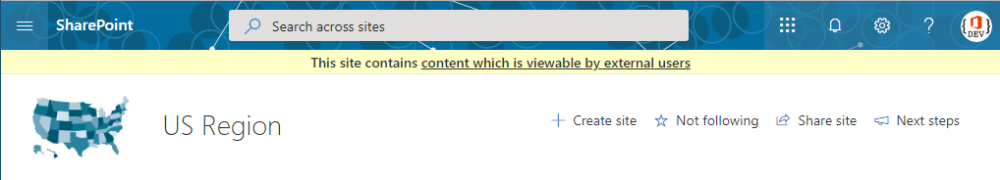

## External Sharing Banner

Add a banner to your SharePoint Online modern sites indicating whether the site contains any content which is viewable by external users. 

Built using a SharePoint Framework Application Customizer Extension with the Top placeholder. Indication of a site being shared with external users is driven via SharePoint Search REST API.

## Setup Instructions
### Pre-requisites
- App Catalog: Ensure the [App Catalog](https://docs.microsoft.com/en-us/sharepoint/use-app-catalog) is setup in your SharePoint Online tenant

### Installation
1. Download the SPFx package [external-sharing-banner.sppkg](https://github.com/bschlintz/spfx-external-sharing-banner/blob/master/sharepoint/solution/external-sharing-banner.sppkg) file from Github (or clone the repo and build the package yourself)
2. Upload sppkg file to the 'Apps for SharePoint' library in your Tenant App Catalog
3. Click the 'Make this solution available to all sites in your organization' checkbox and then click Deploy
4. On the App Catalog site, navigate to the Site Contents page and then click on Tenant Wide Extensions
5.	You should see an item added to the Tenant Wide Extensions list; you may update the text, colors or cache settings if needed

> __Note__: You may have to wait a few hours for the Tenant Wide Extension to propagate the very first time you use this feature. Subsequent Tenant Wide Extension items or updates to existing items will take effect much quicker.

### Updates
Follow the same steps as installation. Overwrite the existing package in the 'Apps for SharePoint' library when uploading the new package. 

> __Tip #1__: Be sure to check-in the sppkg file after the deployment if it is left checked-out.

> __Tip #2__: Ensure there aren't duplicate entries in the Tenant Wide Extensions list after deploying an update. Delete any duplicates if there are any.

## Configuration
This solution is deployed using [Tenant Wide Extensions](https://docs.microsoft.com/en-us/sharepoint/dev/spfx/extensions/basics/tenant-wide-deployment-extensions). You can modify the configuration of the External Sharing Banner via JSON properties via the item added to the Tenant Wide Extensions list. The available properties are below.

| Property Name       | Default Value | Description |
| ------------------- | ------------- | ----- |
| externalSharingText | `"This site contains <a href='{siteurl}/_layouts/15/siteanalytics.aspx'>content which is viewable by external users</a>"` | Text or HTML. Supports {siteurl} and {weburl} tokens. |
| textColor | `"#333"` | Text color shown within the banner. |
| backgroundColor | `"#ffffc6"` | Background color of the banner. |
| textFontSizePx | `14` | Font size of the banner text in pixels. |
| bannerHeightPx | `30` | Height of the banner in pixels. |
| cacheEnabled | `true` | Enable or disable session cache. Cache is per site or web depending on configured scope. |
| cacheLifetimeMins | `15` | Number of minutes session cache is valid before re-fetching from the Search REST API. |
| scope | `"site"` | Site or Web scope is supported. |
| hiddenForExternalUsers | `true` | Toggle whether to display the banner to external users. |
| siteExclusionList | `[]` | An array of sites where the banner will not be rendered. |

## Disclaimer

Microsoft provides programming examples for illustration only, without warranty either expressed or implied, including, but not limited to, the implied warranties of merchantability and/or fitness for a particular purpose. We grant You a nonexclusive, royalty-free right to use and modify the Sample Code and to reproduce and distribute the object code form of the Sample Code, provided that You agree: (i) to not use Our name, logo, or trademarks to market Your software product in which the Sample Code is embedded; (ii) to include a valid copyright notice on Your software product in which the Sample Code is embedded; and (iii) to indemnify, hold harmless, and defend Us and Our suppliers from and against any claims or lawsuits, including attorneys' fees, that arise or result from the use or distribution of the Sample Code.
